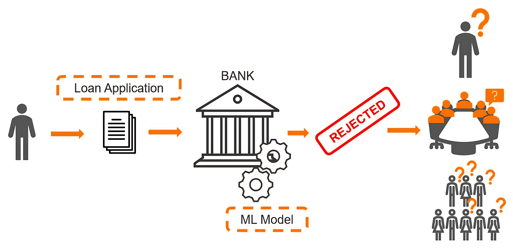

# XAI Bank Honours Project 
This was completed as part of UTS honours projects requirements. Link to my presentation are below: 
Honours Project Presentation:
Video Presentation Of web Application:
https://www.youtube.com/watch?v=daU6-F2Ww6o
https://www.youtube.com/watch?v=j7LDvvPFKcY&t

## How Does XAI Bank Help?

XAI Bank was developed using a decision tree, and the decision-making process was explained through the LIME model. This approach enhances transparency by providing interpretable insights into complex machine learning models.

To improve user comprehension, a part of this development utilized theoretical principles like cognitive load to understand how to appropriately present results for end users.

Based on an empirical survey, XAI Bank utilizes radar charts and a language model to further aid users in understanding the features used within the machine learning model. In this context, the web app helps the end user understand the outcome of their loan application, which often in the real world is not transparent due to the complex systems utilized.

This web app is the outcome of extensive empirical research conducted as part of the UTS Honors project.

# Functionality of XAI Bank

The following funconality is incorporated within this web app:
        <ul style="padding-top: 10px;">
            <li>Decision Tree Modelling</li>
            <li>XAI Lime interpretability model</li>
            <li>Radar Chart Visualisation</li>
            <li>GPT4ALL Lanuage model, specifically orca-mini</li>
            <li>Streamlit For Design</li>

# How To RUN
Download this repository, download GPT4ALL orcha MINI. 
Replace the location of orca mini in the file pages > loan_application.py 
PATH = 'C:/Users/Reese/AppData/Local/nomic.ai/GPT4All/orca-mini-3b-gguf2-q4_0.gguf'

Afterwards run in terminal streamlit run Home.py
